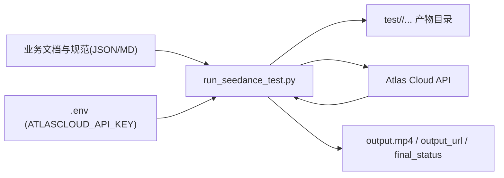
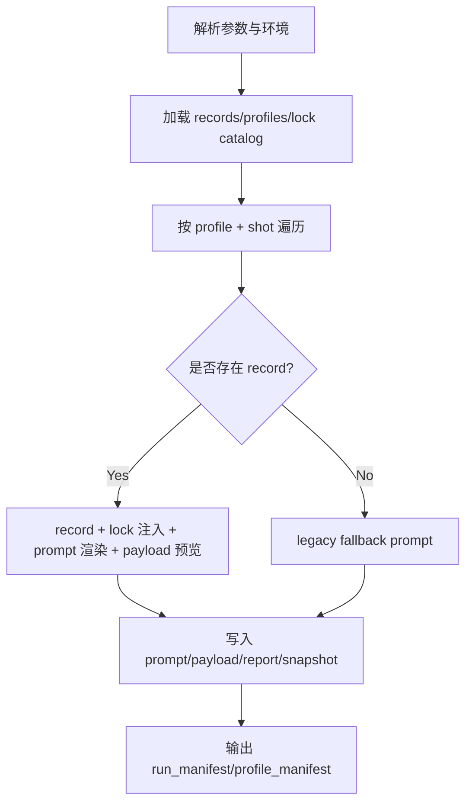

# Technical Architecture Document (TAD)

## 1. 文档信息

- 项目名称：`Short_videoGEN`
- 文档版本：`v1.0`
- 生成日期：`2026-04-24`
- 适用范围：当前仓库内可执行程序 `scripts/run_seedance_test.py` 及其依赖的数据资产
- 目标读者：技术负责人、提示词工程师、内容制作团队、自动化脚本维护者

---

## 2. 架构目标与边界

### 2.1 架构目标

当前程序的核心目标是把“镜头语义记录（record）”自动转换为可执行的模型请求，并完成两类任务：

1. `prepare-only` 模式：只生成提示词与请求预览文件，不调用外部 API。
2. `api-generate` 模式：调用 Atlas Cloud Seedance API，轮询结果并下载视频文件。

### 2.2 架构边界

本仓库是“文档工程 + 轻量执行脚本”架构，不是完整后端服务。当前不包含：

- Web 服务/API Server
- 数据库
- 异步任务队列
- 多机分布式调度

---

## 3. 总体架构概览

### 3.1 架构风格

采用**单脚本分层管道（Pipeline-in-Script）**架构：

- 输入层：JSON 记录与配置文件
- 适配层：语义渲染 + 模型能力降级策略
- 执行层：HTTP 调用 Atlas Cloud API
- 产物层：实验目录中的可追溯文件集合

### 3.2 系统上下文

---

## 4. 目录与资产分层

### 4.1 代码与执行层

- `scripts/run_seedance_test.py`：主执行入口（唯一运行时核心脚本）
- `scripts/README_seedance.md`：脚本使用说明
- `requirements.txt`：运行依赖（`requests>=2.31.0`）
- `.env` / `.env.example`：API 密钥配置

### 4.2 结构化数据层（运行时输入）

- `SampleChapter_项目文件整理版/06_当前项目的视觉与AI执行层文档/records/*_record.json`
- `.../30_model_capability_profiles_v1.json`
- `.../35_character_lock_profiles_v1.json`

### 4.3 规范层（当前多为 Spec）

- `.../27_prompt_schema_v1.json`
- `.../28_prompt_record_template_v1.json`
- `.../29_prompt_episode_manifest_v1.json`
- `.../31_prompt_adapter_interface_v1.md`

说明：这些规范文件中部分标记为 `draft_spec_only`，用于约束未来扩展，不等于都已强制校验接入。

### 4.4 运行产物层

- `test/<experiment_name>/run_manifest.json`
- `test/<experiment_name>[/<profile_id>]/profile_manifest.json`
- `test/<experiment_name>[/<profile_id>]/<shot_id>/...`（prompt、payload、report、视频等）

---

## 5. 逻辑组件设计

### 5.1 CLI 编排组件（Orchestrator）

负责：

- 参数解析（`--prepare-only`、`--shots`、`--profile-ids`、`--records-dir` 等）
- 环境变量加载（`.env`）
- 执行模式控制（准备模式 vs API 模式）
- profile/shot 双层循环调度
- 统一异常落盘（`error.txt`）

对应函数：

- `parse_args`
- `select_shots`
- `main`

### 5.2 数据加载组件（Catalog Loader）

负责：

- 发现 record 文件并按 `shot_id` 建立映射
- 读取模型能力配置 catalog
- 读取角色锁定配置 catalog
- 缺失或解析异常时生成 issue/downgrade 信息

对应函数：

- `discover_record_files`
- `load_model_profiles_catalog`
- `load_character_lock_catalog`
- `resolve_model_profile`

### 5.3 角色锁定注入组件（Character Lock Hydrator）

负责把 record 内引用的 `lock_profile_id` 展开为完整角色外观/服饰锁定信息，减少 record 重复。

对应函数：

- `hydrate_record_with_character_locks`
- `merge_character_node_with_lock`

### 5.4 提示词渲染组件（Prompt Renderer）

把语义字段合成最终 prompt，并根据模型能力决定“avoid”映射策略：

- 若模型支持 negative 字段：`avoid -> negative_prompt`
- 若不支持：`avoid -> 正向约束句`，并记录 downgrade

对应函数：

- `render_prompt_bundle`
- `build_character_lock_phrases`
- `build_positive_constraints_from_avoid`

### 5.5 生成参数决策组件（Generation Resolver）

负责解析并兜底关键参数：

- 比例选择与降级（`select_ratio`）
- 分辨率选择与降级（`select_resolution`）
- 时长估算与 clamp（`resolve_duration`, `estimate_duration_seconds`）
- payload 字段映射（`build_payload_preview`）

### 5.6 运行与下载组件（API Runner）

负责：

- 提交生成请求
- 轮询 prediction 状态
- 解析结果 URL
- 下载 `output.mp4`

对应函数：

- `post_generate_payload`
- `poll_until_done`
- `extract_output_url`
- `download_file`
- `run_one_shot_payload`

---

## 6. 核心数据模型

### 6.1 Shot（代码内置）

- 字段：`shot_id`, `prompt`
- 默认内置：`SH02`, `SH05`, `SH10`
- 作用：当找不到 record 文件时，作为 legacy fallback 输入

### 6.2 Record（`*_record.json`）

核心字段族：

- `record_header`（project/episode/shot 元信息）
- `global_settings`（ratio/resolution/duration/generate_audio）
- `character_anchor`（角色锚点，可带 `lock_profile_id`）
- `scene_anchor`（场景必备元素与道具约束）
- `shot_execution`（镜头类型/运动/动作意图/情绪意图）
- `prompt_render`（positive/negative/dialogue/subtitle 渲染片段）
- `continuity_rules`、`qa_rules`（连续性与质检约束）

### 6.3 Model Profile（`30_model_capability_profiles_v1.json`）

关键能力维度：

- `supports_negative_prompt`
- `supports_audio_generation`
- `duration_min_sec`, `duration_max_sec`
- `supported_resolutions`, `supported_ratios`
- `payload_fields`（跨模型字段映射协议）

### 6.4 Character Lock Profile（`35_character_lock_profiles_v1.json`）

关键字段：

- `lock_profile_id`
- `appearance_lock_profile`
- `costume_lock_profile`
- `appearance_anchor_tokens`
- `forbidden_drift`

---

## 7. 关键执行流程

### 7.1 Prepare-Only 流程

### 7.2 API 生成流程

在 Prepare 流程基础上增加：

1. 校验 `ATLASCLOUD_API_KEY`
2. 校验 profile provider 必须为 `atlascloud`
3. 提交 `payload.preview.json` 到 Atlas
4. 轮询状态直至完成或失败/超时
5. 下载 `output.mp4`

---

## 8. 外部接口设计

### 8.1 命令行接口（CLI）

关键参数：

- `--experiment-name`：实验目录名
- `--shots`：镜头列表（逗号分隔）
- `--prepare-only`：仅准备产物，不调 API
- `--no-audio`：关闭 `generate_audio`
- `--records-dir`：record 来源目录
- `--model-profiles`：模型能力配置文件
- `--model-profile-id` / `--profile-ids`：profile 选择
- `--character-lock-profiles`：角色锁定配置
- `--poll-interval` / `--timeout`：轮询策略

### 8.2 外部 HTTP 接口（Atlas Cloud）

- `POST /api/v1/model/generateVideo`
- `GET /api/v1/model/prediction/{prediction_id}`

鉴权方式：

- `Authorization: Bearer <ATLASCLOUD_API_KEY>`

---

## 9. 文件产物协议

每个镜头目录典型输出：

- `prompt.final.txt`
- `negative_prompt.txt`
- `duration_used.txt`
- `payload.preview.json`
- `request_payload.preview.json`
- `render_report.json`
- `record.snapshot.json`
- `output.pending.txt`（prepare-only 时）
- `generate_request_response.json`（API 模式）
- `final_status.json`（API 模式）
- `output_url.txt`（API 模式）
- `output.mp4`（API 模式）
- `error.txt`（异常时）

---

## 10. 降级与容错机制

### 10.1 明确实现的降级策略

- profile 缺失：回退到 `fallback_non_negative_profile`
- negative 不支持：avoid 转正向约束 + `no_negative_field` downgrade
- ratio/resolution 不支持：自动选择可用值并记录 downgrade
- duration 越界：自动 clamp 并记录 downgrade
- record 缺失：回退 legacy prompt

### 10.2 错误处理

- 单镜头失败不会阻断整个批次
- 错误写入对应 `shot_dir/error.txt`
- 控制台打印 `[ERROR] profile/shot: ...`

---

## 11. 可观测性与追溯

当前系统主要通过**文件化可观测性**实现追溯：

- `run_manifest.json`：记录本次批次上下文（模式、shots、profiles、catalog issues）
- `profile_manifest.json`：记录 profile 级元信息
- `render_report.json`：记录语义映射结果、downgrade 与人工复核标记
- `record.snapshot.json`：记录注入 lock 后的最终输入快照

该设计可支持后续 A/B 对比与复盘自动化。

---

## 12. 安全与合规考虑

- API Key 通过 `.env`/环境变量注入，不硬编码到脚本
- 产物默认写本地 `test/` 目录，不自动上传第三方存储
- 当前未实现日志脱敏（建议后续避免把敏感 header/body 落盘）

---

## 13. 性能与扩展性评估

### 13.1 当前实现特性

- 串行执行 profile 与 shot（简单稳定，吞吐有限）
- 以文件系统为中心，便于人审与调试

### 13.2 后续可扩展方向

1. 并行执行（按 shot 并发）以提升批量生成效率。
2. 增加 JSON Schema 校验，提前阻断脏数据。
3. 抽离 Adapter 为独立模块（与 `31_prompt_adapter_interface_v1.md` 对齐）。
4. 引入自动 QA 打分器并回写 `qa_rules.pass_fail`。
5. 引入统一日志格式（如 JSON lines）便于可视化分析。

---

## 14. 已知限制

1. API 模式不支持多 profile 并行（`--profile-ids` 多值仅 prepare-only 可用）。
2. 当前主路径依赖 Atlas provider；其他 provider 只具备 prepare 适配能力。
3. 规范文件中部分内容仍为 draft，尚未形成强约束校验链。
4. 单脚本架构在团队协作扩大后会面临可维护性挑战。

---

## 15. 结论

当前 `Short_videoGEN` 的技术架构已经形成“可执行最小闭环”：

- 语义 record -> prompt/payload 渲染 -> API 生成 -> 可追溯产物

同时通过 profile 能力建模与 downgrade 机制，兼顾了“模型差异适配”与“工程可复盘性”。下一阶段建议优先推进 schema 校验、并行执行与 QA 自动化，以支撑从实验验证走向规模化生产。

