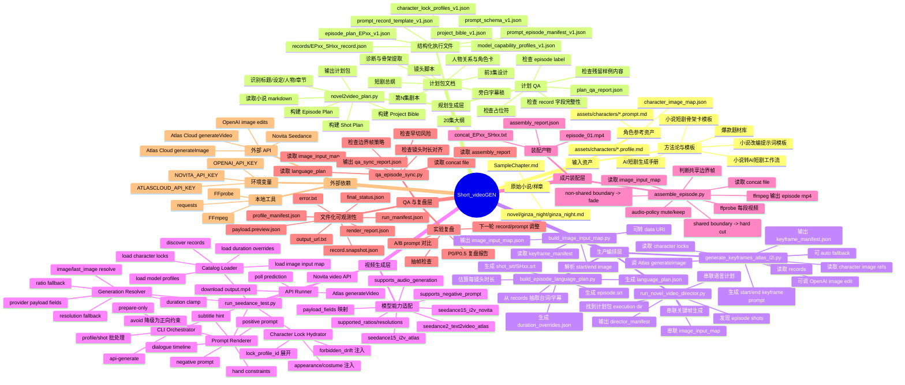
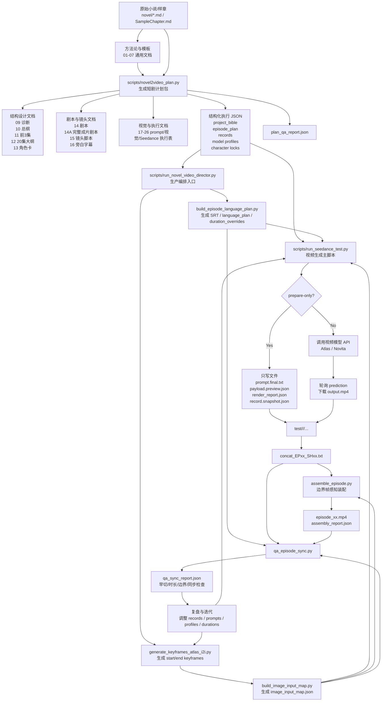

# Short_videoGEN 全流程 Architecture Mind Map

> 用途：把当前仓库的“小说/样章 -> 短剧计划包 -> 镜头提示词 -> 关键帧 -> 视频生成 -> 成片装配 -> QA 复盘”流程整理成可视化架构草图。  
> 你可以把本文件直接交给大模型、Mermaid 渲染器、Figma/Whimsical/Miro/Excalidraw 等工具，让它生成更漂亮的 diagram。

---

## 1. 一句话架构

`Short_videoGEN` 是一个“文档主导 + JSON 结构化计划 + Python 脚本流水线 + 文件化实验产物”的 AI 短剧生成工程。

核心闭环：

```text
小说/样章输入
  -> 短剧改编与结构设计
  -> 分集/剧本/镜头计划
  -> record JSON + profile JSON
  -> language plan + keyframes + image_input_map
  -> Seedance / provider 视频生成
  -> FFmpeg 成片装配
  -> QA 报告与复盘
```

---

## 2. Mind Map 版本



---

## 3. 端到端 Flowchart 版本



---

## 4. 数据与产物流

```mermaid
flowchart LR
  subgraph Source["Source / Templates"]
    S1["novel/*.md"]
    S2["SampleChapter_项目文件整理版<br/>方法论 + 模板"]
    S3["assets/characters<br/>角色设定与参考图映射"]
  end

  subgraph Planning["Planning Bundle"]
    P1["project_bible_v1.json"]
    P2["episode_plan_EPxx_v1.json"]
    P3["Markdown Docs 09-26"]
    P4["records/EPxx_SHxx_record.json"]
    P5["30_model_capability_profiles_v1.json"]
    P6["35_character_lock_profiles_v1.json"]
  end

  subgraph Production["Production Inputs"]
    I1["language_plan.json"]
    I2["duration_overrides.json"]
    I3["keyframe_manifest.json"]
    I4["image_input_map.json"]
  end

  subgraph ShotOutputs["Per-shot Outputs"]
    O1["prompt.final.txt"]
    O2["negative_prompt.txt"]
    O3["payload.preview.json"]
    O4["render_report.json"]
    O5["record.snapshot.json"]
    O6["output.mp4"]
  end

  subgraph EpisodeOutputs["Episode Outputs"]
    E1["concat file"]
    E2["episode_xx.mp4"]
    E3["assembly_report.json"]
    E4["qa_sync_report.json"]
  end

  S1 --> Planning
  S2 --> Planning
  S3 --> Planning
  Planning --> Production
  Planning --> ShotOutputs
  Production --> ShotOutputs
  ShotOutputs --> EpisodeOutputs
  EpisodeOutputs --> Planning
```



---

## 5. 关键脚本职责表

| 脚本 | 位置 | 主要输入 | 主要输出 | 职责 |
|---|---|---|---|---|
| `novel2video_plan.py` | `scripts/` | 小说 md、模板、平台参数 | 计划包目录、records、profiles、QA | 从小说生成短剧项目计划包 |
| `run_novel_video_director.py` | `scripts/` | 计划包目录、episode、shots | director manifest、语言计划、关键帧、image map | 串联生产前置流程 |
| `build_episode_language_plan.py` | `scripts/` | records | SRT、language_plan、duration_overrides | 统一台词/字幕/时长规划 |
| `generate_keyframes_atlas_i2i.py` | `scripts/` | records、character locks、character image map | keyframes、keyframe_manifest | 生成 I2V 起止关键帧 |
| `build_image_input_map.py` | `scripts/` | keyframe_manifest | image_input_map.json | 把关键帧转换成视频生成输入映射 |
| `run_seedance_test.py` | `scripts/` | records、profiles、locks、duration、image map | prompt、payload、report、output.mp4 | 渲染 prompt/payload 并调用视频模型 |
| `assemble_episode.py` | `scripts/` | concat file、image_input_map、shot mp4 | episode mp4、assembly_report | 装配镜头，处理硬切/淡入淡出 |
| `qa_episode_sync.py` | `scripts/` | language_plan、concat、image map、assembly report | qa_sync_report | 检查同步、早切、边界帧策略 |

---

## 6. 可视化设计建议

如果要生成更漂亮的 architecture diagram，建议使用三段式横向布局：

```text
[Content Planning] -> [AI Production Pipeline] -> [Assembly + QA Loop]
```

推荐视觉分组：

- 蓝色：输入与方法论文档
- 紫色：计划包与结构化 JSON
- 绿色：生产脚本与中间产物
- 橙色：外部 AI provider/API
- 红色：QA、降级、错误与复盘
- 灰色：文件化可观测性产物

---

## 7. 可直接复制给大模型的美化提示词

```text
请根据下面的 Short_videoGEN 架构信息，生成一张漂亮、清晰、类似 mind map + architecture diagram 的系统图。

目标：
- 表达这是一个“文档主导 + JSON 结构化计划 + Python 脚本流水线 + 文件化实验产物”的 AI 短剧生成工程。
- 图要能让技术负责人、提示词工程师、内容制作团队都看懂。
- 使用横向三段式布局：Content Planning -> AI Production Pipeline -> Assembly + QA Loop。
- 保留关键脚本名、关键文件名、关键数据流。
- 风格专业、清爽、适合放进技术文档或产品说明。

核心流程：
1. 原始小说/样章和通用方法论模板进入 scripts/novel2video_plan.py。
2. novel2video_plan.py 生成短剧计划包：
   - 09 诊断与骨架提取
   - 10 短剧总纲
   - 11 前3集设计
   - 12 20集大纲
   - 13 人物关系与角色卡
   - 14 剧本
   - 15 镜头脚本
   - 16 旁白字幕
   - 17-26 视觉、提示词、Seedance 执行文档
   - project_bible_v1.json
   - episode_plan_EPxx_v1.json
   - records/EPxx_SHxx_record.json
   - 30_model_capability_profiles_v1.json
   - 35_character_lock_profiles_v1.json
3. scripts/run_novel_video_director.py 作为生产编排入口，串联：
   - build_episode_language_plan.py -> language_plan.json、duration_overrides.json、SRT
   - generate_keyframes_atlas_i2i.py -> keyframes、keyframe_manifest.json
   - build_image_input_map.py -> image_input_map.json
4. scripts/run_seedance_test.py 是视频生成主脚本：
   - 加载 records、model profiles、character locks、duration overrides、image_input_map
   - 注入角色锁定
   - 渲染 positive prompt / negative prompt / dialogue timeline / subtitle hint
   - 根据模型能力做 duration、ratio、resolution、negative prompt 降级
   - prepare-only 模式输出 prompt.final.txt、payload.preview.json、render_report.json、record.snapshot.json
   - api-generate 模式调用 Atlas/Novita，轮询 prediction，下载 output.mp4
5. assemble_episode.py 读取 concat file、image_input_map、shot output.mp4，使用 FFmpeg 装配 episode_xx.mp4：
   - 共享边界帧使用 hard cut
   - 非共享边界帧使用轻量 fade
   - 输出 assembly_report.json
6. qa_episode_sync.py 读取 language_plan、concat file、image_input_map、assembly_report，输出 qa_sync_report.json，检查早切、时长、同步、边界帧策略。
7. QA 和复盘结果会反馈到 records、prompts、profiles、duration 或 keyframe 策略，形成迭代闭环。

外部依赖：
- ATLASCLOUD_API_KEY / NOVITA_API_KEY / OPENAI_API_KEY
- Atlas Cloud generateVideo / generateImage
- Novita Seedance
- OpenAI image edits
- FFmpeg / FFprobe

请把图分成以下颜色：
- 输入与方法论文档：蓝色
- 计划包与 JSON：紫色
- 生产脚本与中间产物：绿色
- 外部 AI API：橙色
- QA、降级、错误、复盘：红色
- 文件化可观测性产物：灰色

请突出：
- records 是镜头语义单元
- model profiles 是模型能力适配层
- character locks 是角色一致性层
- image_input_map 是关键帧到 I2V 的桥
- render_report / run_manifest / profile_manifest 是可追溯观测层
- QA loop 会回写改进下一轮生成
```

