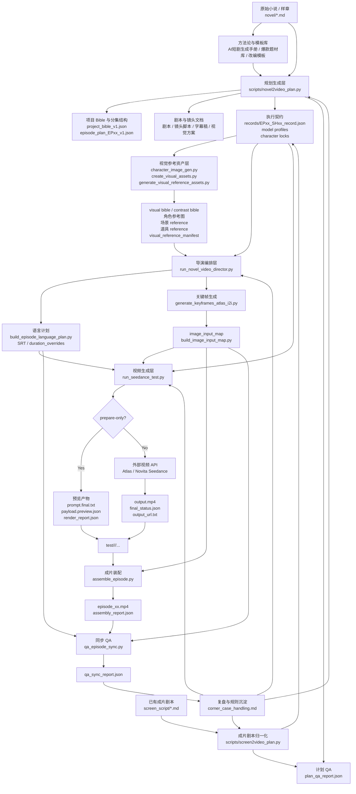
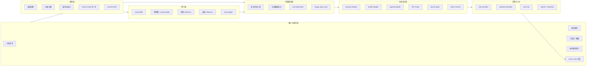
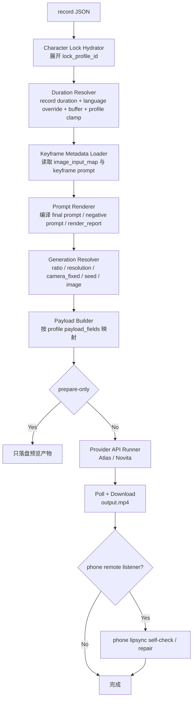
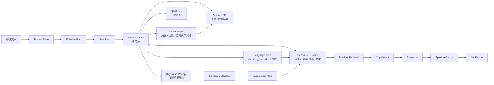
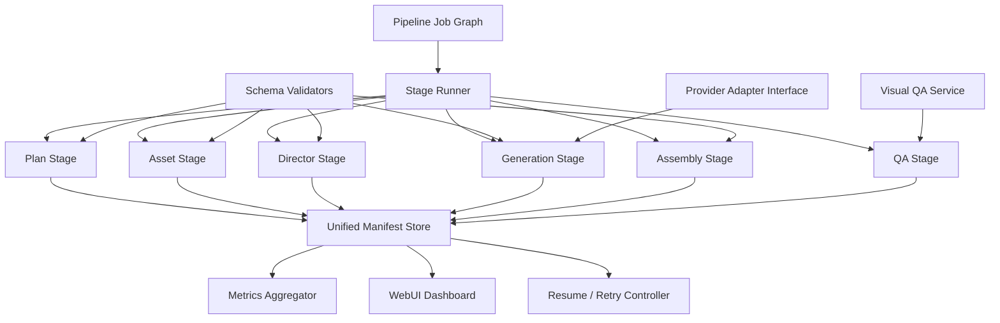

# Short_videoGEN 技术架构评审

> 日期：2026-04-29  
> 更新状态：已对照 2026-04-29 晚间当前工作区再次更新。
> 范围：`Short_videoGEN` 小说 / 成片剧本到 AI 短剧生成流水线，包括规划、资产、关键帧、I2V、装配、QA、本地 WebUI 与批量调度。
> 评审依据：仓库现有文档、`corner_case_handling.md`、核心脚本、`test/` 产物结构与 WebUI 代码。

## 1. 总体结论

`Short_videoGEN` 当前不是一个单纯的“prompt 调用脚本”，而是一个以文档方法论为上游、以结构化 record 为事实源、以模型能力 profile 为适配层、以文件化产物为可观测状态的 AI 短剧生产系统。它已经从“小说转视频”单入口，推进到“小说规划”和“已有成片剧本归一化”两条入口共用同一执行链路的阶段。

它的核心架构特征可以概括为：

- **文档主导**：小说、方法论、剧集结构、视觉设定和生产任务单共同构成上游创作资产。
- **双入口归一**：`novel2video_plan.py` 从小说生成剧集计划；`screen2video_plan.py` 把已有分集剧本规范化成同样的 bundle / record 结构。
- **Record 驱动**：每个镜头的 `*_record.json` 是执行层事实源，最终 prompt、payload、关键帧、时长和 QA 都围绕 record 编译。
- **多阶段流水线**：系统不是一次性生成视频，而是分成规划、语言时长、视觉参考、关键帧、I2V、装配和 QA 多个阶段。
- **模型适配中间层**：`model_capability_profiles_v1.json` 与 runtime renderer 共同承担 provider 差异、负向提示支持、音频支持、时长、比例和 payload 字段映射。
- **文件化可追溯性**：每个阶段都把 `prompt.final.txt`、`payload.preview.json`、`render_report.json`、`keyframe_manifest.json`、`assembly_report.json` 等落盘，方便复盘和局部重跑。
- **经验记忆闭环**：`corner_case_handling.md` 把实跑中发现的失败模式固化成工程规则，反向约束规划、关键帧和视频生成。
- **批量调度雏形**：`run_novel_episode_batch.py` 与 `screen2video_play.py` 已经把 plan、refs、director、Seedance、assembly、QA 串成可选 stage pipeline，并默认把 planning QA 作为下游硬门禁。
- **资产 Bible 化**：`visual_asset_core.py` 和 `create_visual_assets.py` 把角色、场景、道具参考图从单次 prompt 扩展为 visual bible、contrast bible、视觉 QA 与 manifest 管理。

从成熟度看，它已经超过概念验证阶段，属于“架构优先的早期生产工作台”。优势是语义抽象、视觉一致性控制、资产复用、批量门禁和生产记忆；短板是统一调度的产品化、指标体系、schema 强校验和多项目规模化运行还没有完全闭合。

## 2. 端到端架构流程图



这个图体现了系统的关键取向：视频不是直接从小说生成，而是经过多个可检查、可覆盖、可复跑的中间层逐步编译出来。

## 3. 主要模块总览



## 4. 模块详解

### 4.1 输入与方法论模块

**主要文件**

- `novel/ginza_night/ginza_night.md`
- `SampleChapter_*/`
- `docs/I2V_prompt_design_rules.md`
- `corner_case_handling.md`
- 各项目目录中的 `01_总方法论与项目底层文档/`、`02_模板与通用执行文档/`

**功能**

这一层定义系统“要把什么内容改编成什么形态”。它包含原始小说、题材判断、短剧改编方法、提示词模板、I2V 设计规则和历史 corner case。

它不是运行时脚本，但对运行时有强约束力。例如：

- record 内容是事实源。
- scene-only 镜头不能继承主角 identity anchor。
- 临时角色使用 ephemeral anchor。
- 静态道具必须有数量、位置、首帧可见性和运动策略。
- 照片朝向必须明确。
- 电话远端听者必须闭嘴但脸部可见。
- 混合来源 clip 装配时要统一尺寸并保留音频，除非明确静音。

**架构价值**

这层把“创作经验”显式化，避免系统沦为 prompt 手艺人的口头经验。更重要的是，它让失败案例能够变成下一次生成前的工程约束。

### 4.2 规划生成模块：`scripts/novel2video_plan.py`

**输入**

- 原始小说 markdown。
- 项目名、episode id、平台目标等 CLI 参数。
- 可选 LLM 后端。
- 已有角色资产目录。

**输出**

- 项目结构文档：诊断、总纲、分集大纲、角色卡、剧本、镜头脚本、字幕稿、视觉方案、任务单。
- 结构化执行文件：`project_bible_v1.json`、`episode_plan_EPxx_v1.json`。
- 镜头级 record：`records/EPxx_SHxx_record.json`。
- 模型与角色配置：`30_model_capability_profiles_v1.json`、`35_character_lock_profiles_v1.json`。
- `plan_qa_report.json`。

**核心职责**

1. **小说解析与项目识别**  
   读取 markdown 标题、章节结构和正文片段，生成项目源信息。对 GinzaNight 这类“章节即剧集”的项目，会按原文章节数构建 episode outline，避免固定 20 集模板压缩原文结构。

2. **项目 Bible 构建**  
   将故事类型、世界观、核心人物、冲突、爽点、分集大纲结构化，形成后续生产的内容边界。

3. **镜头计划生成**  
   把 episode 内容拆成 `ShotPlan`，再进一步生成可执行 record。这里不仅写剧情，还写 I2V 所需的执行契约，如 dialogue blocking、first frame contract、prop contract、scene motion contract。

4. **I2V 风险前置处理**  
   规划阶段已经开始处理一镜多任务、对白归属、电话听者、照片正反面、首帧脸部可见、静态道具稳定性等问题。这个设计非常关键，因为很多视频失败无法在最终 prompt 阶段可靠修复。

5. **计划 QA**  
   `run_plan_qa()` 检查占位符、episode 数、record 完整性、I2V prompt 设计风险、对白可见性、首帧脸部可见性、道具契约等。

6. **服装与吸烟动作门禁**
   近期已把 episode-level 服装连续性写进 LLM fact / shot prompt，并在 QA 中检查 `或/or/任选/候选/二选一` 等服装候选写法。另有窄域禁烟动作规则：阻断点香烟、按灭香烟、熄灭烟头等动作，但不误伤烧文件这类非香烟火源剧情。

**评审意见**

这是系统的语义核心。它不是简单把小说转 prompt，而是在上游把“故事事实、镜头任务、视觉契约、模型风险”一起编译成 record。这个模块的设计方向正确，近期新增的服装连续性和禁烟动作规则说明 corner case 已经可以从日志回流到 planner 和 QA。未来应继续加强 schema 强校验和不同小说类型的泛化能力。

### 4.2A 成片剧本归一化模块：`scripts/screen2video_plan.py`

**输入**

- `screen_script/归档/epXXX.md` 或单个成片剧本 markdown。
- 项目名、episode id、最大镜头数、输出 bundle 目录。

**输出**

- 与小说规划一致的项目目录结构。
- `project_bible_v1.json`、`episode_plan_EPxx_v1.json`。
- `records/EPxx_SHxx_record.json`。
- `35_character_lock_profiles_v1.json`。
- `character_image_map.json` 占位与角色 profile / prompt 文件。
- `plan_qa_report.json`。

**核心职责**

`screen2video_plan.py` 把已有成片剧本作为 source of truth，解析标题、场景块、视觉 beat、对白、音乐提示和 hook，再生成现有 director / keyframe / Seedance / assembly / QA 可以消费的同构 bundle。

它的关键价值不是重写故事，而是做“忠实规范化”：

- `source_trace.source_type=screen_script`，并写入 `screen_script_is_source_of_truth=true`。
- 临时角色保留 ephemeral 策略，不强行要求 identity lock。
- 角色与道具仍落到 record 契约，后续沿用同一 QA 与 visual reference 链路。
- 可通过 `--qa-strict` 让 screen-script bundle 在进入视觉资产和视频生成前接受同一套 planning QA。

**评审意见**

这是当前架构的一个重要推进：系统不再只服务“从小说自动改编”，也能承接已经写好的短剧脚本，把它们归一到同一执行层。这样，创作入口可以多样化，而下游生产链路仍保持统一。

### 4.3 Record 契约模块

**主要资产**

- `records/EPxx_SHxx_record.json`
- `27_prompt_schema_v1.json`
- `28_prompt_record_template_v1.json`
- `29_prompt_episode_manifest_v1.json`
- `31_prompt_adapter_interface_v1.md`

**功能**

record 是镜头级 source of truth。它把一个镜头从自然语言描述拆成可执行契约：

- `record_header`：项目、剧集、镜头 ID。
- `global_settings`：比例、分辨率、时长、音频等。
- `character_anchor`：角色、身份、lock profile、临时角色策略。
- `scene_anchor`：场景、必备元素、道具。
- `shot_execution`：景别、镜头运动、动作意图、情绪意图。
- `first_frame_contract`：首帧稳定状态、可见角色、脸部可见性。
- `dialogue_blocking`：谁说话、谁沉默、电话/画外音归属。
- `i2v_contract`：道具库、道具契约、电话契约、照片朝向等。
- `prompt_render`：正向核心、负向项、字幕/台词渲染片段。
- `qa_rules` 与 `continuity_rules`：质量与连续性要求。

**架构价值**

record 模块把最终 prompt 从“手写字符串”升级成“编译产物”。这样系统可以在多个阶段读取同一个事实源：

- keyframe prompt 从 record 编译。
- Seedance prompt 从 record 编译。
- language plan 从 record 抽取对白和字幕。
- visual refs 从 record 抽取道具。
- QA 从 record 检查风险。

这也是系统可扩展性的基础。

### 4.4 视觉资产模块

**主要脚本**

- `scripts/character_image_gen.py`
- `scripts/visual_asset_core.py`
- `scripts/create_visual_assets.py`
- `scripts/generate_visual_reference_assets.py`
- `scripts/generate_cover_pages.py`
- `scripts/build_image_input_map.py`

**功能**

视觉资产模块负责在视频生成前准备可复用视觉参考。近期它已经从“生成若干参考图”推进到“先形成可校验 visual bible，再生成图像并记录 QA”的资产生产层：

1. **共享视觉资产核心**
   `visual_asset_core.py` 集中管理角色 / 场景 / 道具 visual bible、prompt builder、Grok image generation、OpenAI 角色视觉 QA、重试与 response 摘要。`character_image_gen.py` 和 `generate_visual_reference_assets.py` 已开始复用这个核心，避免角色图和 visual refs 各自维护一套 prompt 规则。

2. **角色 visual bible 与 contrast bible**
   `create_visual_assets.py` 会从 records、lock profiles 和角色资料生成 `*.visual_bible.json`，并维护 `character_contrast_bible.json`。角色 prompt 不再只靠 profile 自然语言，而是显式写出年龄段、脸型骨相、发型轮廓、身体框架、固定服装、头身比例、禁止相似项和 pairwise 区分规则。

3. **角色参考图与视觉 QA**
   角色图生成后可以触发 OpenAI 视觉 QA，检查年龄、性别、脸部可见、头身比例、服装匹配和身份区分度；失败时写出 repair prompt 并可重试。这个能力直接对应近期 screen-script 角色资产中的成人比例、儿童年龄感、总裁/助理相似度等真实问题。

4. **场景 reference**
   `generate_visual_reference_assets.py` 从 `scene_detail.txt` 自动提取场景，生成空场景 reference image。规则要求场景图不出现人物、人体局部、倒影人物或照片人物，确保 scene-only 镜头不会误继承角色身份。

5. **道具 reference**
   同一脚本从 records 的 `i2v_contract.prop_library` 和 `prop_contract` 抽取道具，生成固定道具 reference，尤其适合照片、按钮、手机、证物等容易被模型自由发挥的物体。文本密集道具会转成不可读灰色排版块策略，避免强制模型生成清晰姓名、机构、页眉和正文。

6. **统一资产创建入口**
   `create_visual_assets.py` 可以一次处理 `characters,scenes,props`，输出统一的 `visual_reference_manifest.json`。它同时服务 novel bundle 和 screen-script bundle，支持 dry-run、跳过图片生成、覆盖生成、强制重建 bible、角色 QA 开关等参数。

7. **封面页**
   `generate_cover_pages.py` 提供 episode cover 资产，后续可在 `assemble_episode.py` 中自动发现并插入。

8. **image input map**
   `build_image_input_map.py` 从 `keyframe_manifest.json` 提取每个镜头的 `image` 和 `last_image`，形成 I2V 输入映射。

**评审意见**

视觉资产模块的最大价值是把“人物身份参考”和“场景/道具参考”分开，并进一步把参考图生产变成可复盘资产工程。scene-only 镜头和临时角色镜头如果硬套主角图，会造成身份污染；而现在的 visual bible / contrast bible / manifest 机制让系统既能复用资产，又能说明资产为什么长这样、是否通过 QA、来自哪个 record 或 profile。

### 4.5 导演编排模块：`scripts/run_novel_video_director.py`

**输入**

- episode bundle。
- records 目录。
- character lock profiles。
- character image map。
- 可选 visual reference manifest。
- episode id 与 shots。

**输出**

- language plan 实验目录。
- keyframe 实验目录。
- `duration_overrides.json`。
- `keyframe_manifest.json`。
- `image_input_map.json`。
- director manifest。

**核心职责**

1. **发现 execution dir 与镜头列表**  
   从计划包找到 `06_当前项目的视觉与AI执行层文档/records`，按 episode 与 CLI 参数确定镜头集合。

2. **角色参考图预检**  
   `validate_character_image_map()` 会检查 record 中需要角色参考的镜头是否能在 image map 中找到资产。

3. **关键帧静态化清洗**  
   `prepare_keyframe_static_records()` 会把适合视频运动的描述清洗成适合首帧生成的静态描述，避免关键帧 prompt 出现“走进、打开、转身”等时间动作，导致 keyframe 被做成拼贴或连续动作图。

4. **串联语言计划、关键帧、image map**  
   它把 `build_episode_language_plan.py`、`generate_keyframes_atlas_i2i.py`、`build_image_input_map.py` 组织成一个半自动导演流程。

5. **承接 visual refs**  
   新增 `--visual-reference-manifest` 后，director 可以把场景/道具 reference 传给关键帧生成模块。

**评审意见**

这个模块是目前最接近“生产编排层”的脚本。它已经降低了人工手动串脚本的成本，但还不是完整 job orchestrator。未来可以把它扩展成可恢复、可跳步、可记录 stage status 的统一 runner。

### 4.6 语言与时长模块：`scripts/build_episode_language_plan.py`

**输入**

- records。
- shots。
- 字幕来源策略。
- 字符速度、行间隔、尾部 padding、最小时长和最大时长。

**输出**

- `episode.srt`
- `shot_srt/SHxx.srt`
- `duration_overrides.json`
- `language_plan.json`
- 风险项，如 `speech_overflow_risk`、`max_duration_limit_risk`

**功能**

这个模块解决 AI 视频常见的“台词没说完镜头已经切走”问题。它从 record 中抽取对白或字幕，按字符数估算每句时长，生成镜头内 timeline，再把推荐时长写入 `duration_overrides.json`。

**关键设计**

- 以 dialogue 作为默认字幕来源，避免字幕和模型语音不一致。
- 对每个 shot 单独生成 SRT，也生成 episode 总 SRT。
- 当台词总时长超过原始 `duration_sec` 时，记录风险并向上调整时长。
- 输出整数秒 override，供后续 provider payload 使用。

**评审意见**

这是一层很实用的生产控制。它把“语言时长”从视频模型的随机输出中抽离出来，变成先验约束。对于短剧这种对白密度高的内容，这个模块直接影响可用片段比例。

### 4.7 关键帧生成模块：`scripts/generate_keyframes_atlas_i2i.py`

**输入**

- records。
- character lock profiles。
- character image map。
- visual reference manifest。
- image provider 配置：OpenAI、Atlas-hosted OpenAI、Grok 或 auto fallback。
- phases：start / end。

**输出**

- 每镜头每 phase 的 `prompt.txt`。
- `payload.preview.json`。
- `start.png` 或对应图片文件。
- provider response、`final_status.json`、`output_url.txt`。
- `keyframe_manifest.json`。

**功能**

关键帧模块把 record 中的首帧视觉契约编译为图像编辑请求。它使用角色图、场景 reference、道具 reference 来生成更稳定的起始帧，为后续 I2V 提供 `image` 或 `last_image`。

**关键能力**

- 支持多 provider：Atlas generateImage、OpenAI image edits、Grok image edits。
- 支持 auto fallback：Atlas 429/5xx/network 等 retryable failure 后可切 OpenAI。
- 记录每个 phase 的图片输入、prompt、payload 与输出路径。
- 可选择 start/end phase，当前 director 默认跑 start keyframes。
- 承接静态化 records，避免 keyframe 误生成动态动作。
- 遇到 `lock_prompt_enabled=false` 且没有真实 lock material 的临时角色时，不再从 `character_image_map` 请求 identity 图，只保留文字身份描述与场景 / 道具 reference。

**评审意见**

关键帧模块是视觉一致性控制的核心之一。它把 I2V 从“纯文本驱动”升级为“首帧约束驱动”。从架构角度看，关键帧是 record 和视频之间的视觉编译层，能显著降低角色漂移、场景漂移和首帧不稳定。

### 4.8 视频生成模块：`scripts/run_seedance_test.py`

**输入**

- records。
- model profile。
- character lock profiles。
- duration overrides。
- image input map。
- keyframe prompt metadata。
- provider/API 参数。

**输出**

- `prompt.final.txt`
- `negative_prompt.txt`
- `payload.preview.json`
- `render_report.json`
- `record.snapshot.json`
- `duration_used.txt`
- `image_used.txt` / `last_image_used.txt`
- `output.mp4`
- `final_status.json`
- phone repair 相关产物。

**内部组件 Flow Chart**



**核心职责**

1. **角色锁定注入**  
   `hydrate_record_with_character_locks()` 将 record 中引用的 `lock_profile_id` 展开为角色外观、服装、禁止漂移项，减少 record 重复。

2. **Prompt 编译**  
   `render_prompt_bundle()` 把 record 的场景、角色、动作、对白、道具、电话、照片、首帧和禁用项编译为最终 prompt。对于不支持 negative prompt 的 profile，会把 avoid 约束改写为正向约束。

3. **Provider payload 映射**  
   `build_payload_preview()` 根据 profile 的 `payload_fields` 把 prompt、duration、resolution、ratio、audio、image、last_image、camera_fixed、seed 映射为 provider 接受的 payload。

4. **模型能力降级**  
   ratio、resolution、duration、audio、negative prompt 都由 profile 决定。比如 Novita Seedance duration 必须是整数，系统会在 resolver 阶段向上取整并 clamp 到 provider 范围。

5. **I2V 图像输入解析**  
   `resolve_image_inputs()` 从 image input map 或 CLI 参数中解析 `image` / `last_image`，并支持本地文件转 data URI。

6. **对白与旁白绑定**  
   record audio mapping 是事实源：如果 record 只有 dialogue，则 prompt 必须含对白；只有 narration，则按画外旁白处理；两者都有时 dialogue 优先，避免模型把旁白误生成人物口型。

7. **电话听者自检与修复**  
   对 remote phone listener，系统会检查可见嘴部风险、生成 contact sheet，并可走 `generate_audio=false` 的 phone repair，再把音频合回。

8. **Seedance preflight 窄域安全阻断**
   视频 prompt 生成后会再次扫描点香烟、熄灭烟头、按入烟灰缸等吸烟动作。如果命中，`run_seedance_test.py` 在发 API 前抛错；但规则明确不扩大到烧文件、纸页燃烧等非香烟火源动作。

**评审意见**

这是当前代码实现最厚的模块，也是架构抽象落地最多的地方。它同时承担 prompt compiler、profile adapter、payload builder、API runner 和部分 QA/repair。长期看可以拆成更清晰的库模块，但现阶段集中在一个脚本中有利于快速演化。

### 4.9 成片装配模块：`scripts/assemble_episode.py`

**输入**

- FFmpeg concat file。
- I2V clips。
- `image_input_map.json`。
- 可选 `clip_overrides.json`。
- 可选 cover page directory。

**输出**

- episode mp4。
- `assembly_report.json`。

**功能**

装配模块把逐镜头视频拼成完整 episode。它不是简单 concat，而是带有边界帧认知和输出规范化：

- 读取每段视频 duration、音频流、尺寸。
- 根据 `image_input_map` 判断前后镜头是否共享边界帧。
- 共享边界默认 hard cut，避免在同一画面之间做 fade 造成视觉糊化。
- 非共享边界可做 fade。
- 支持 clip override，用于替换某个镜头的更优候选，例如 phone-fix rerun 版本。
- 默认统一输出尺寸、fps，避免混合来源 clips 装配时尺寸不一致。
- 音频策略支持 keep/mute，当缺失音频时自动降级。
- 可自动发现并插入 episode cover page。

**评审意见**

这个模块体现了系统对 AI 视频“后期生产问题”的理解。很多 AI 视频 pipeline 停在生成单 clip，而这里已经开始处理边界、音频、尺寸和候选替换，这对真实成片非常重要。

### 4.10 QA 与可观测性模块

**主要脚本与产物**

- `novel2video_plan.py` 内置 `run_plan_qa()`。
- `scripts/qa_episode_sync.py`
- `assembly_report.json`
- `render_report.json`
- `run_manifest.json`
- `profile_manifest.json`
- `keyframe_manifest.json`
- `qa_sync_report.json`

**功能**

QA 被分散在多个阶段：

1. **Planning QA**  
   检查 record 质量、占位符、episode count、首帧脸部可见、对白可见、道具契约、I2V prompt 设计风险。

2. **Render Report**  
   `run_seedance_test.py` 输出每个 shot 的 render report，记录 downgrade、manual review requirement、resolved generation、首帧政策检查等。

3. **Assembly Report**  
   `assemble_episode.py` 记录边界帧、转场策略、音频策略、尺寸、clip overrides。

4. **Sync QA**  
   `qa_episode_sync.py` 检查字幕来源、早切风险、缺失 keyframe、共享边界转场违规。

**评审意见**

当前 QA 的优点是贯穿链路、产物可追踪；不足是还偏规则与报告，没有形成统一指标看板。未来应将成功率、重试率、可用率、人工干预次数、成本、失败分类等纳入统一 metrics。

### 4.11 WebUI 控制台模块

**主要文件**

- `webui/backend/main.py`
- `webui/frontend/src/main.tsx`
- `webui/README.md`

**功能**

WebUI 是本地单用户控制台，不替代 CLI，而是给现有 CLI pipeline 加一个状态索引和操作界面。

后端使用 FastAPI 和 SQLite，主要表包括：

- `projects`
- `episodes`
- `shots`
- `jobs`
- `assets`
- `review_runs`

前端使用 React/Vite，展示项目、episode、shots、assets、jobs/runs，并能触发 pipeline steps。近期新增了资产浏览视图：可以发现 `novel/` 与 `screen_script/` 下的 asset root，按 character / scene / prop 和 visual refs batch 浏览图片，并读取、编辑同名 `.prompt.txt` / `.prompt.md` sidecar。

**架构特点**

- SQLite 只作为索引，不把源产物搬进数据库。
- 源文件仍保存在 repo 与 `test/` 目录。
- CLI 脚本仍可直接运行，WebUI 是控制层而不是强绑定平台。
- 对 OpenAI image 与 Seedance video 使用 provider semaphore，避免本地 UI 并发打爆外部 API。
- 资产浏览 API 只允许访问 repo 下 `novel/` 或 `screen_script/` 的 `assets` 目录，并限制 prompt 保存为同目录同 stem 的 sidecar，降低误写任意文件的风险。

**评审意见**

WebUI 的定位很健康：它没有过早把系统重构成服务化平台，而是先把本地生产流程可视化、可触发、可审查。新增资产浏览器后，它已经从“pipeline 状态面板”向“资产 review workstation”迈了一步，尤其适合人工检查角色参考图、visual bible prompt 和场景 / 道具 reference。

### 4.12 批量调度模块：`scripts/run_novel_episode_batch.py` 与 `scripts/screen2video_play.py`

**功能**

这两个脚本已经把过去需要手工串联的 CLI 阶段，组织成可批量运行的 pipeline：

- `plan`
- `refs`
- `director`
- `seedance`
- `assemble`
- `qa`

`run_novel_episode_batch.py` 面向小说 bundle；`screen2video_play.py` 面向已有成片剧本目录。两者都支持 episode range、shot 子集、dry-run、strict 模式、cover page、audio policy、visual refs 覆盖重建和 batch manifest。

**关键推进**

- 默认给 planning 追加 `--qa-strict`，并在已有 bundle / 跳过 planning 时读取 `plan_qa_report.json`。
- 若 planning QA 不通过，默认在 visual refs / keyframes / video 前停止；只有显式 `--allow-plan-qa-fail` 才能越过。
- novel batch 支持 `--plan-extra-args`，可把 `--backend llm --llm-shot-mode per-shot` 等参数透传给 planner。
- screen batch 在 director 前检查 `character_image_map.json` JSON 有效性；真实图片完整性仍交给 director 按 selected records 精确校验。
- 每个 episode 写入 test 下 batch manifest，记录每个 stage 的命令、return code、输出目录和最终视频路径。

**评审意见**

这说明原文档“建议建立 canonical pipeline runner”的短期目标已经部分落地。它还不是完整 job graph service，但已经具备生产实用价值：能跑多集、能中途停、能避免坏 planning 进入昂贵生成阶段，并把一次批跑的状态记录下来。

## 5. 核心数据流与契约



### 5.1 Record 作为事实源

该系统最重要的技术边界是：**record content is source of truth**。keyframe metadata、prompt renderer 和 image map 可以补充执行信息，但不能静默覆盖 record 的剧情意图。

这个原则解决了 AI 生成系统常见的“下游 prompt 漂移”问题。只要最终视频出现偏差，就可以追踪偏差来自：

- record 本身写错；
- keyframe prompt 编译错误；
- video prompt 编译错误；
- provider payload 降级；
- 模型随机失败；
- 装配替换了错误候选。

### 5.2 Profile 作为模型能力契约

`model_capability_profiles_v1.json` 让系统不直接把 prompt 写死给某个模型，而是通过 profile 描述：

- provider。
- model name。
- 是否支持 negative prompt。
- 是否支持 audio generation。
- 支持比例与分辨率。
- 时长范围。
- payload 字段名。
- payload defaults。

这使同一个 record 有机会编译到 Atlas Seedance、Novita Seedance 或其他后续 provider。

### 5.3 Manifest 作为运行状态

系统没有中心数据库来承载所有运行状态，而是把状态写成文件：

- `run_manifest.json`
- `profile_manifest.json`
- `keyframe_manifest.json`
- `visual_reference_manifest.json`
- `*.visual_bible.json`
- `character_contrast_bible.json`
- `assembly_report.json`
- `qa_sync_report.json`

这让每次实验可以独立复盘，也方便只重跑失败的阶段。缺点是跨实验汇总和全局指标需要额外工具。

## 6. 系统架构的创新点

### 6.1 从 prompt-first 转向 record-first

大多数 AI 视频工作流以最终 prompt 为中心，导致上游故事事实、角色一致性、镜头任务和模型限制混在一段自然语言里。`Short_videoGEN` 的创新在于把 prompt 降级为编译产物，把 record 升级为事实源。

这样做的好处是：

- 剧情意图可检查。
- 角色、场景、道具可结构化复用。
- 不同模型可以从同一个 record 生成不同 payload。
- QA 可以在生成前介入。
- 历史 corner case 可以固化为 record 字段或 planner 规则。

### 6.2 把 I2V 失败前置到规划层处理

系统没有等视频失败后才修 prompt，而是在规划阶段就写入 I2V-aware contract：

- 一镜一任务。
- 单 active speaker。
- 电话远端声音与画面内听者分离。
- 首帧可见角色必须露脸。
- 静态道具必须固定数量、位置、可见性和运动策略。
- 照片正反面和朝向必须明确。

这是一种“生成前治理”架构。它的创新点在于承认视频模型的能力边界，并把边界转化为上游镜头设计约束。

### 6.3 角色身份 reference 与场景/道具 reference 分离

系统明确区分：

- 主角色 identity reference。
- 空场景 reference。
- 静态道具 reference。
- 临时角色文字/ephemeral anchor。

这避免了 scene-only 镜头误继承主角脸，也避免服务员、警员、路人等临时角色被错误绑定到主角 lock profile。对于多集短剧，这个分离会显著降低视觉污染。

### 6.3A Visual Bible 与 Contrast Bible 资产治理

近期新增的 `visual_asset_core.py` / `create_visual_assets.py` 把视觉资产从 prompt 文本推进到结构化 bible：

- 角色 bible 写明年龄、脸型、体态、固定服装、比例契约和禁止漂移。
- contrast bible 写明同项目角色之间必须拉开的视觉差异。
- 场景 bible 写明地点、布局、材质、光线和时代地域。
- 道具 bible 写明数量、材质、结构、拍摄角度和可读文字策略。

这让资产生产不再只是“生成一张图”，而是形成可审查、可重生、可 QA、可复用的资产契约。它尤其适合处理多角色相似、儿童年龄比例、服装连续性、文本道具不可读等高频失败点。

### 6.4 关键帧静态化作为中间编译层

视频 prompt 往往需要动作，但关键帧 prompt 需要稳定首帧。`run_novel_video_director.py` 在进入 keyframe 生成前会生成 `keyframe_static_records`，把动态动作改写成静态状态。

这是很有价值的中间层设计，因为它承认“同一个 record 在不同模型阶段需要不同编译目标”：

- keyframe 编译目标：稳定、单帧、可作为 I2V 起点。
- video 编译目标：动作、台词、情绪、时间推进。

### 6.5 语言计划驱动时长，而不是让模型自由裁剪

短剧生产中，台词是否完整直接影响成片可用性。系统用 `build_episode_language_plan.py` 先估算对白 timeline，再把 `duration_overrides` 传给视频生成。

这个设计把“视频长度”从经验参数变成由文本长度、尾部 padding 和 provider 限制共同决定的可解释值。

### 6.6 模型能力 profile 与 downgrade 机制

系统没有假设所有模型都支持同样字段。例如 negative prompt 不支持时，会尝试正向改写；duration 不符合 provider schema 时，会取整并 clamp；固定机位会映射到支持 `camera_fixed` 的 payload 字段。

这是一种早期的 prompt middleware 架构，未来可以发展为更完整的 provider adapter layer。

### 6.7 边界帧感知装配

`assemble_episode.py` 能根据 image input map 判断相邻镜头是否共享边界帧。共享边界 hard cut，非共享边界可 fade。这比粗暴统一转场更贴近 AI 视频素材特性。

再加上 clip override，系统可以把多候选生成、人选最佳 clip、最终装配这几件事串起来，并在 report 里保留可追溯记录。

### 6.8 Corner Case 记忆成为架构组成部分

`corner_case_handling.md` 不是普通日志，而是生产规则库。它记录现象、根因、无效方案、有效方案和系统化改进建议，并反向影响脚本设计。

这种“失败记忆工程化”的机制是系统长期演化的关键创新。AI 视频生成的难点往往不是单次成功，而是不断遇到模型边界后的积累速度。

### 6.9 双入口共用执行链路

`screen2video_plan.py` 的出现让系统可以同时支持“小说自动改编”和“已有短剧脚本生产”。这不是简单多了一个 parser，而是把不同创作源归一到同一 record、profile、visual refs、keyframes、Seedance、assembly 和 QA 链路。

这个设计提升了系统的实用边界：当上游剧本已经成熟时，不必重新走小说改编；当只有小说时，也能自动生成剧本和镜头。两种入口可以共享后续生成资产和失败规则。

## 7. 当前架构风险与不足

### 7.1 编排层已有批量 runner，但还不是完整 job graph

`run_novel_episode_batch.py` 和 `screen2video_play.py` 已经承担了 episode range、stage 顺序、QA 门禁和 batch manifest，原先完全手工串联的问题已有明显改善。但完整链路本质上仍由多个 CLI 组合：

- plan
- visual refs
- language
- keyframes
- image map
- Seedance
- assembly
- QA

剩余问题是：

- 局部失败后的恢复策略不够统一。
- stage 状态分散在不同 manifest 中。
- batch manifest 记录了命令和 return code，但还没有形成可恢复 DAG、重试策略、资源队列和跨项目状态数据库。

### 7.2 Schema 与运行时校验尚未完全闭合

仓库中有 schema、template 和 adapter spec，但部分仍偏文档规范。当前很多检查由 Python 规则完成，而不是统一 schema validation。

建议未来把 record schema、profile schema、manifest schema 与 CI/QA 脚本绑定，减少字段漂移。

### 7.3 指标体系不足

当前可观测性偏文件和报告，还缺少聚合指标：

- 单镜头生成成功率。
- 可用 clip 比例。
- 每镜头平均重跑次数。
- phone repair 成功率。
- 角色漂移失败率。
- 道具漂移失败率。
- 每集成本。
- 人工干预时间。

没有这些指标，优化主要依赖人工印象。

### 7.3A 资产 registry 还处于目录与 manifest 阶段

visual bible、contrast bible 和 `visual_reference_manifest.json` 已经让资产生产可追踪，但还没有真正的 approved asset registry。当前仍主要依赖目录结构、sidecar prompt、manifest 和人工判断来决定某张角色 / 场景 / 道具图是否是“正式可复用版本”。

后续需要明确：

- approved / rejected / needs_regen 状态。
- 同一角色跨 episode 的主参考图版本。
- visual bible 与图片文件的版本绑定。
- WebUI 中的人工验收与 override 写回规则。

### 7.4 Prompt renderer 责任偏重

`run_seedance_test.py` 同时承担 prompt 编译、profile adapter、payload 构建、API 调用、phone repair 和部分 QA。短期有利于迭代，长期会增加维护成本。

建议逐步拆出：

- `prompt_renderer.py`
- `profile_adapter.py`
- `provider_clients.py`
- `repair_pipeline.py`
- `record_validators.py`

### 7.5 多 provider 抽象还处于早期

当前已经支持 Atlas、Novita、OpenAI、Grok 等入口，但 provider 行为差异仍大量写在脚本逻辑里。未来如果接入更多模型，需要更明确的 provider adapter interface 和兼容性测试报告。

### 7.6 QA 仍以规则检查为主，缺少视觉自动评估

现有 QA 能检查文本、时长、边界和 keyframe 缺失。角色参考图层已经引入 OpenAI 视觉 QA，但最终视频中的脸部、口型、道具数量、照片朝向、角色一致性仍主要依赖人工或抽帧观察。

下一阶段可以加入视觉 QA：

- 抽帧 + 多模态检查。
- 人脸一致性 embedding。
- OCR 检查水印/字幕污染。
- 道具数量与位置检查。
- phone listener mouth movement 风险检测。

## 8. 建议的目标架构



### 8.1 短期建议

- 在现有 `run_novel_episode_batch.py` 和 `screen2video_play.py` 基础上，抽出统一 stage runner，避免 novel 与 screen 两条 runner 逻辑继续分叉。
- 每个 stage 统一输出 `stage_manifest.json`，包含输入、输出、状态、失败原因、可恢复点，并由 batch manifest 汇总。
- 将 `create_visual_assets.py` 升级为默认 visual refs 入口；保留 `generate_visual_reference_assets.py` 作为轻量兼容入口或逐步合并。
- 给 `qa_episode_sync.py` 增加更多 assembly 与 ffprobe 检查，并统一报告格式。
- 把 `corner_case_handling.md` 中高频规则映射成 validator checklist。
- 给 WebUI 资产浏览器增加 approved/rejected 状态写回，形成最小资产验收流。

### 8.2 中期建议

- 把 prompt renderer、profile adapter、provider client 从 `run_seedance_test.py` 中拆出。
- 引入统一 schema validation。
- 建立 metrics 汇总脚本或 WebUI 页面。
- 抽帧后接入最终视频视觉 QA，先覆盖脸部可见、字幕污染、道具数量、照片朝向和 phone listener 风险。
- 对不同 shot 类型沉淀 generation recipe，例如 dialogue、reaction、prop close-up、scene-only、phone listener。
- 建立 approved asset registry，统一角色图、场景图、道具图、visual bible、prompt sidecar 与 QA 报告的版本关系。

### 8.3 长期建议

- 构建多 episode 可恢复任务图。
- 建立跨项目资产 registry，跨 episode 复用 approved character/scene/prop refs。
- 将 WebUI 从控制台扩展为 review workstation，支持候选对比、clip acceptance、override 自动写入。
- 建立 provider benchmark，让同一批 records 在不同模型上形成质量、成本、时长和失败率对比。

## 9. 评审总结

`Short_videoGEN` 的技术创新不在于调用了某个视频模型，而在于它把 AI 短剧生产拆成了一个可治理的编译系统：

```text
小说事实 / 成片剧本
  -> 短剧结构 / screen script 归一化
  -> 镜头 record
  -> visual bible、视觉参考与语言时长
  -> keyframe 与 I2V prompt
  -> provider payload
  -> clip
  -> 成片
  -> QA 与 corner case 记忆
```

这个架构的核心优势是把不可控的生成模型包进一套可检查的生产契约里。record-first、I2V-aware planning、screen-script 归一化、模型 profile、visual bible、关键帧静态化、场景/道具 reference、边界帧装配、批量 QA 门禁和 corner case 记忆共同构成了系统的差异化能力。

当前最值得继续投入的是统一 stage runner、schema 强校验、资产验收 registry、指标体系和最终视频视觉自动 QA。如果这些能力补齐，`Short_videoGEN` 将从“强结构生产工作台”进一步变成可规模化运行的 AI 短剧生产平台。
